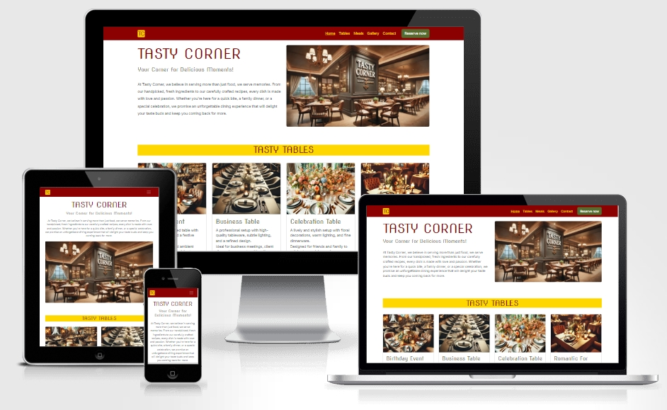
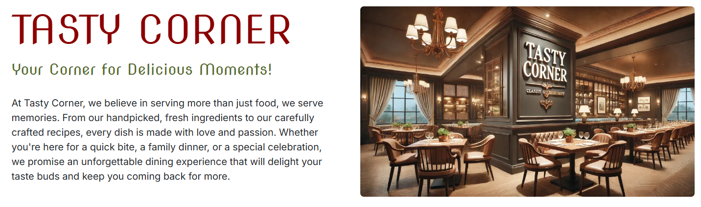
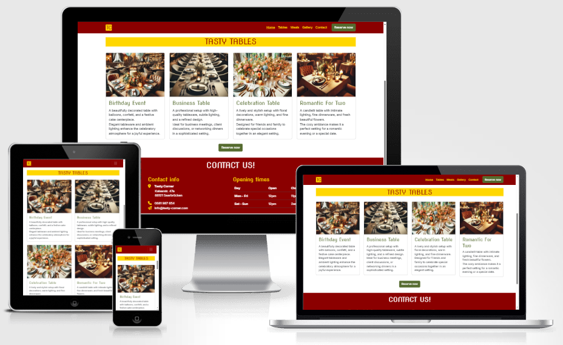
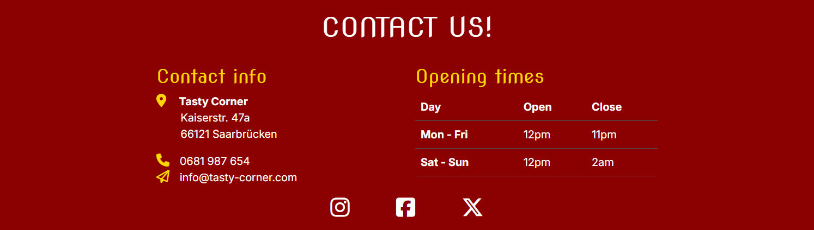
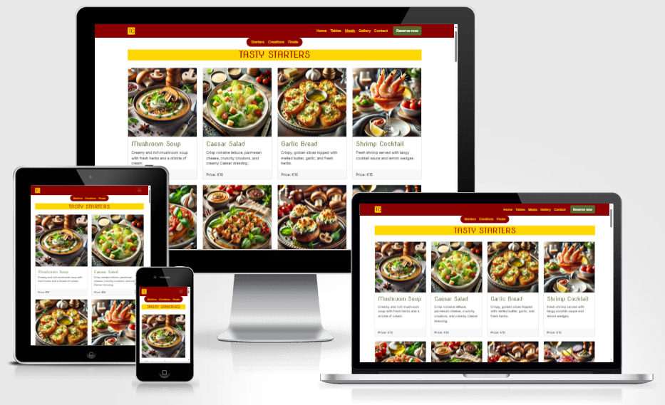
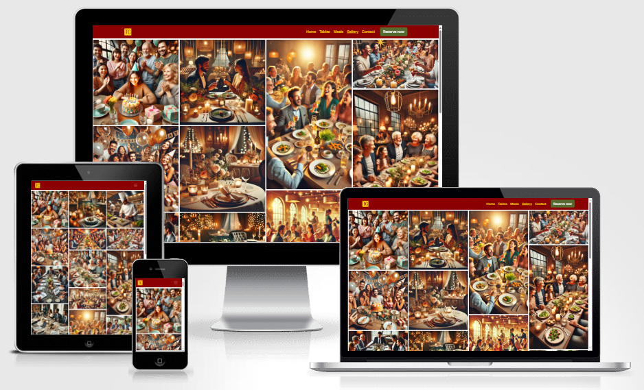
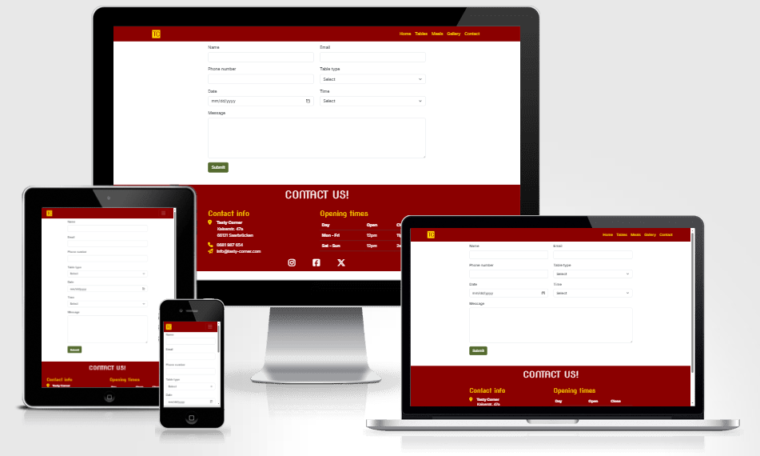
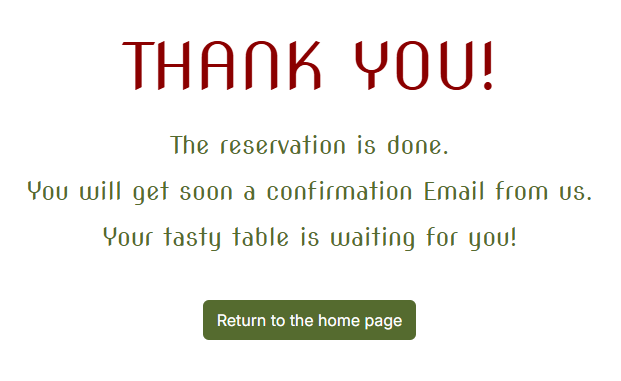

# Tasty Corner

Tasty Corner is a site that aims to help food enthusiasts discover fresh culinary experiences on a regular basis. The site is designed for those who love exploring new recipes, local dining spots, and sharing their passion for great food. Tasty Corner will be a go-to resource for food lovers, offering clear insights on when and where to find the latest and tastiest culinary delights.

## Features 

### Existing Features

- __Navigation Bar__

  - The full responsive navigation bar includes links to the Logo, Home page, Meals, Gallery and Reservation page and is identical in each page to allow for easy navigation.
  - This section will allow the user to easily navigate from page to page across all devices without having to revert back to the previous page via the ‘back’ button.

- __The home page__

  - The home page starts with the restaurant name, lead text, description and a good quality photo of the restaurant to allow the user to see exactly which location this site would be applicable to.

- __Tables Types Section__

  - The tables type section "TASTY TABLES" will allow the user to see the types of the tables that the restaurant can provide.
  - At the end of the secion there is a button to take the user directly to the reservation page.

- __The Footer__ 
  - The footer contains the contact info and the opening times of the restaurant.
  - The footer is valuable to the user as they will be able to easily see the location and the opening times.
  - The footer section includes links to the relevant social media sites for Tasty Corner. The links will open to a new tab to allow easy navigation for the user.

- __Meals Page__

  - The meals page provides the user with image, name, short description and the price of all available Meals (Starters, Creations and Finale).
  - This page is valuable to the user as they will be able to decide what they will order in their visit.
  - The meals page contains a small extra navbar, so the user can easily toggle between starters, creations and finale.

- __Gallery Page__

  - The gallery page provides the user with supporting images to see what the atmosphere is like inside the restaurant.
  - This page is valuable to the user as they will be able to easily identify the types of possible events in the restaurant.

- __The Reservation Page__

  - This page will allow the user to reserve a table. The user will be asked to submit their name, email, phone, table type, date, time and a proper message.

- __The Reservation Success Page__

  - This page will tell the user if the reservation is successfully done or not.
  - This feature is valuable to the user as they will know if they did the reservation successfully, otherwise they have to call the restaurant to confirm the reservation.

### Features Left to Implement

- Newsletter sign up form
- Testimonials

## Testing 

We have thoroughly tested all features of Tasty Corner to ensure a smooth and user-friendly experience. Each page functions as intended, with responsive design adapting well to different screen sizes. Navigation is intuitive, and all forms and interactive elements work correctly. The project effectively provides a seamless way for users to explore the restaurant and make reservations with ease.

### Validator Testing 

- HTML
  - No errors were returned when passing through the official [W3C validator](https://validator.w3.org/nu/?doc=https%3A%2F%2Fcode-institute-org.github.io%2Flove-running-2.0%2Findex.html)
- CSS
  - No errors were found when passing through the official [(Jigsaw) validator](https://jigsaw.w3.org/css-validator/validator?uri=https%3A%2F%2Fvalidator.w3.org%2Fnu%2F%3Fdoc%3Dhttps%253A%252F%252Fcode-institute-org.github.io%252Flove-running-2.0%252Findex.html&profile=css3svg&usermedium=all&warning=1&vextwarning=&lang=en#css)

### Unfixed Bugs

- There is only one small bug that should be fixed. In "Meals" page, there is padding between the extra navbar and the "Starters" section. This should be removed without effecting the functionality of the items in the extra navbar.

## Deployment

- The site was deployed to GitHub pages.

The live link can be found here - https://salah929.github.io/tasty-corner/index.html

## Credits 

In this section you need to reference where you got your content, media and extra help from. It is common practice to use code from other repositories and tutorials, however, it is important to be very specific about these sources to avoid plagiarism. 

You can break the credits section up into Content and Media, depending on what you have included in your project. 

### Content 

- The fonts were taken from [Google Fonts](https://fonts.google.com/)
- The icons in the footer were taken from [Font Awesome](https://fontawesome.com/)